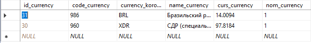
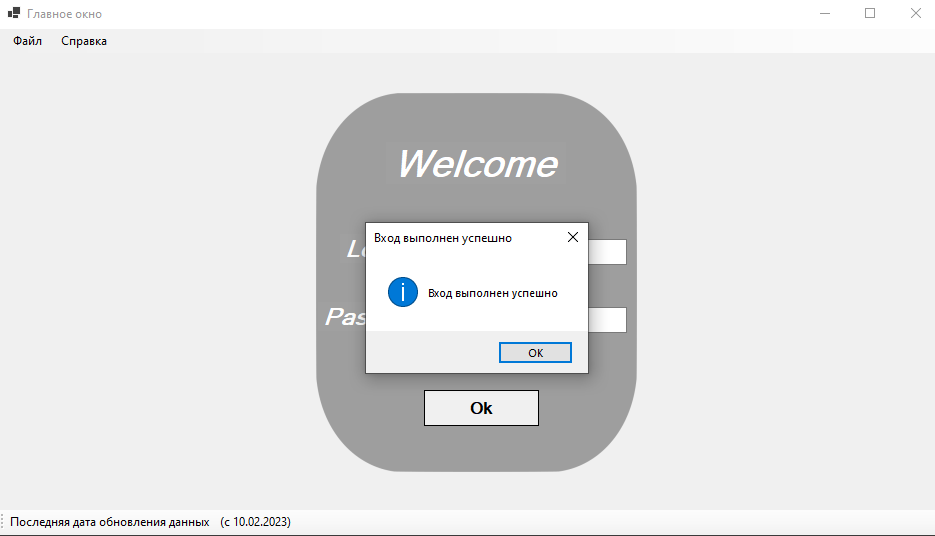
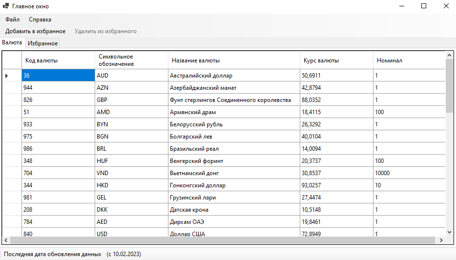

# Интеграция с банком
__Задание__
---
Курс валют
WinForms программа, с авторизацией списком курсов валют по ЦБ РФ и возможностью работать с избранными валютами.
US1: Пользователь запускает программу, авторизуется (логин/пароль) переходит на форму списка курсов валют. Просматривает список актуальных курсов валют
US2:  Авторизовавшись, в списке курсов валют, пользователь выбирает понравившуюся валюту, добавляет её в избранное и просматривает избранное отдельно
US3: Авторизовавшись, пользователь сразу попадает в список избранных валют если он не пуст
Технологии: WinForms+WCF+EntityFramework

---
## Результат:

В данной работе использовалась локальная база данных MSSQL, в которой хранятся избранные валюты (для корректного использования приложения придется создать эту БД (выполнить запрос, который находится в папке с ресурсами) и указать путь к ней в файле DataBase.cs):

Более подробное отражение работы приложения находится в папке "image".
---
Данные для авторизации:
login: 123,
password: 123
---

---

---
___Работу выполнил студент группы ИП - 19 - 3 Стешкин Георгий___